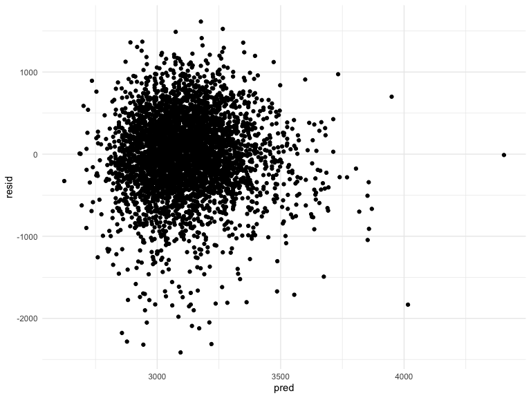
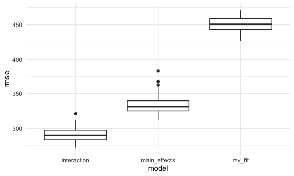

Homework 6
================

``` r
library(tidyverse)
```

    ## ── Attaching packages ─────────────────────────────────────── tidyverse 1.3.1 ──

    ## ✓ ggplot2 3.3.5     ✓ purrr   0.3.4
    ## ✓ tibble  3.1.4     ✓ dplyr   1.0.7
    ## ✓ tidyr   1.1.3     ✓ stringr 1.4.0
    ## ✓ readr   2.0.1     ✓ forcats 0.5.1

    ## ── Conflicts ────────────────────────────────────────── tidyverse_conflicts() ──
    ## x dplyr::filter() masks stats::filter()
    ## x dplyr::lag()    masks stats::lag()

``` r
library(viridis)
```

    ## Loading required package: viridisLite

``` r
library(modelr)

knitr::opts_chunk$set(
  echo = TRUE,
  warning = FALSE, 
  fig.width = 8, 
  fig.height = 6, 
  out.width = "90%"
)
theme_set(theme_minimal() + theme(legend.position = "bottom"))

options(
  ggplot2.continuous.colour = "viridis",
  ggplot2.continuous.fill = "virids"
)

scale_colour_discrete = scale_color_viridis_d
scale_fill_discrete = scale_fill_viridis_d
```

# Problem 1

Importing `birthweigth_df` data set

``` r
birthweight_df = read_csv("./data/birthweight.csv")
```

    ## Rows: 4342 Columns: 20

    ## ── Column specification ────────────────────────────────────────────────────────
    ## Delimiter: ","
    ## dbl (20): babysex, bhead, blength, bwt, delwt, fincome, frace, gaweeks, malf...

    ## 
    ## ℹ Use `spec()` to retrieve the full column specification for this data.
    ## ℹ Specify the column types or set `show_col_types = FALSE` to quiet this message.

Cleaning dataset

-   `frace` = “unknown” (9) to missing (n/a)
-   `malform` changed from `numeric` to `factor`

## any other data cleaning to do???

-   no other missing values
-   most variables continuous - keep as `numeric`

``` r
birthweight_df %>% 
  mutate(frace = ifelse(is.na(frace), 9, frace),
         malform = as.factor(malform))
```

    ## # A tibble: 4,342 × 20
    ##    babysex bhead blength   bwt delwt fincome frace gaweeks malform menarche
    ##      <dbl> <dbl>   <dbl> <dbl> <dbl>   <dbl> <dbl>   <dbl> <fct>      <dbl>
    ##  1       2    34      51  3629   177      35     1    39.9 0             13
    ##  2       1    34      48  3062   156      65     2    25.9 0             14
    ##  3       2    36      50  3345   148      85     1    39.9 0             12
    ##  4       1    34      52  3062   157      55     1    40   0             14
    ##  5       2    34      52  3374   156       5     1    41.6 0             13
    ##  6       1    33      52  3374   129      55     1    40.7 0             12
    ##  7       2    33      46  2523   126      96     2    40.3 0             14
    ##  8       2    33      49  2778   140       5     1    37.4 0             12
    ##  9       1    36      52  3515   146      85     1    40.3 0             11
    ## 10       1    33      50  3459   169      75     2    40.7 0             12
    ## # … with 4,332 more rows, and 10 more variables: mheight <dbl>, momage <dbl>,
    ## #   mrace <dbl>, parity <dbl>, pnumlbw <dbl>, pnumsga <dbl>, ppbmi <dbl>,
    ## #   ppwt <dbl>, smoken <dbl>, wtgain <dbl>

### Regression model proposal

Previous research shows that many of the variables in this data set are
associated with birth weight. In my proposed model I am looking to
combine 2 variables, 2 biological (`babysex` and `delwt`) and one
environmental predictor (`smoken`) as well as the interactions as a
model of birth weight.

``` r
my_fit = lm(bwt ~ delwt * babysex + smoken * babysex, data = birthweight_df)

broom::tidy(my_fit)
```

    ## # A tibble: 6 × 5
    ##   term           estimate std.error statistic  p.value
    ##   <chr>             <dbl>     <dbl>     <dbl>    <dbl>
    ## 1 (Intercept)    2245.      156.       14.4   6.17e-46
    ## 2 delwt             7.13      1.06      6.73  1.88e-11
    ## 3 babysex         -55.7      98.0      -0.568 5.70e- 1
    ## 4 smoken           -9.75      3.14     -3.10  1.93e- 3
    ## 5 delwt:babysex    -0.276     0.666    -0.415 6.79e- 1
    ## 6 babysex:smoken    2.27      2.00      1.13  2.57e- 1

Plotting residuals against fitted values

``` r
birthweight_df %>% 
  modelr::add_residuals(my_fit) %>% 
  modelr::add_predictions(my_fit) %>% 
  ggplot(aes(x = pred, y = resid)) + 
  geom_point()
```



Comparing to other models

``` r
main_effects = 
  lm(bwt ~ blength + gaweeks, data = birthweight_df)

interaction = 
  lm(bwt ~ bhead * blength * babysex, data = birthweight_df)

broom::tidy(main_effects)
```

    ## # A tibble: 3 × 5
    ##   term        estimate std.error statistic  p.value
    ##   <chr>          <dbl>     <dbl>     <dbl>    <dbl>
    ## 1 (Intercept)  -4348.      98.0      -44.4 0       
    ## 2 blength        129.       1.99      64.6 0       
    ## 3 gaweeks         27.0      1.72      15.7 2.36e-54

``` r
broom::tidy(interaction)
```

    ## # A tibble: 8 × 5
    ##   term                   estimate std.error statistic     p.value
    ##   <chr>                     <dbl>     <dbl>     <dbl>       <dbl>
    ## 1 (Intercept)           -13552.     2759.       -4.91 0.000000939
    ## 2 bhead                    380.       83.4       4.56 0.00000528 
    ## 3 blength                  226.       57.4       3.94 0.0000843  
    ## 4 babysex                 6375.     1678.        3.80 0.000147   
    ## 5 bhead:blength             -4.43      1.72     -2.58 0.00981    
    ## 6 bhead:babysex           -198.       51.1      -3.88 0.000105   
    ## 7 blength:babysex         -124.       35.1      -3.52 0.000429   
    ## 8 bhead:blength:babysex      3.88      1.06      3.67 0.000245

Comparing models with cross validation

``` r
cv_df = 
  crossv_mc(birthweight_df, 100) %>% 
  mutate(
    train = map(train, as_tibble),
    test = map(test, as_tibble)
  )
```

Fitting models and extracting RSME

``` r
cv_df = 
  cv_df %>% 
  mutate(
    my_fit = map(.x = train, ~lm(bwt ~ delwt * babysex + smoken * babysex, data = .x)),
    main_effects = map(.x = train, ~lm(bwt ~ blength + gaweeks, data = .x)),
    interaction = map(.x = train, ~lm(bwt ~ bhead * blength * babysex, data = .x))
  ) %>% 
  mutate(
    rmse_my_fit = map2_dbl(.x = my_fit, .y = test, ~rmse(model = .x, data = .y)),
      rmse_main_effects = map2_dbl(.x = main_effects, .y = test, ~rmse(model = .x, data = .y)),
     rmse_interaction = map2_dbl(.x = interaction, .y = test, ~rmse(model = .x, data = .y))
  )
```

RMSE distributions

``` r
cv_df %>% 
  select(.id, starts_with("rmse")) %>% 
  pivot_longer(
    rmse_my_fit:rmse_interaction,
    names_to = "model", 
    values_to = "rmse",
    names_prefix = "rmse_"
  ) %>% 
  ggplot(aes(x = model, y = rmse)) + 
  geom_boxplot()
```



From this output, I would use the `interaction` model because it shows
the lowest ditribution of RMSE scores.
