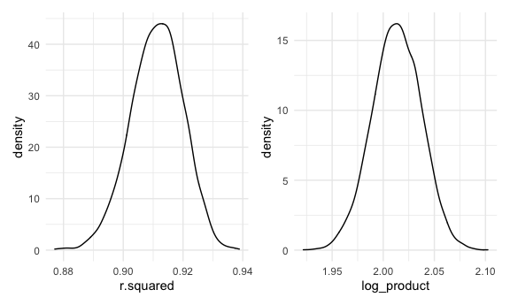

Homework 6
================

``` r
library(tidyverse)
```

    ## ── Attaching packages ─────────────────────────────────────── tidyverse 1.3.1 ──

    ## ✓ ggplot2 3.3.5     ✓ purrr   0.3.4
    ## ✓ tibble  3.1.4     ✓ dplyr   1.0.7
    ## ✓ tidyr   1.1.3     ✓ stringr 1.4.0
    ## ✓ readr   2.0.1     ✓ forcats 0.5.1

    ## ── Conflicts ────────────────────────────────────────── tidyverse_conflicts() ──
    ## x dplyr::filter() masks stats::filter()
    ## x dplyr::lag()    masks stats::lag()

``` r
library(viridis)
```

    ## Loading required package: viridisLite

``` r
library(modelr)
library(patchwork)

knitr::opts_chunk$set(
  echo = TRUE,
  warning = FALSE, 
  fig.width = 6, 
  fig.asp = .6,
  out.width = "90%"
)
theme_set(theme_minimal() + theme(legend.position = "bottom"))

options(
  ggplot2.continuous.colour = "viridis",
  ggplot2.continuous.fill = "virids"
)

scale_colour_discrete = scale_color_viridis_d
scale_fill_discrete = scale_fill_viridis_d
```

# Problem 1

Importing `birthweigth_df` data set

``` r
birthweight_df = read_csv("./data/birthweight.csv")
```

    ## Rows: 4342 Columns: 20

    ## ── Column specification ────────────────────────────────────────────────────────
    ## Delimiter: ","
    ## dbl (20): babysex, bhead, blength, bwt, delwt, fincome, frace, gaweeks, malf...

    ## 
    ## ℹ Use `spec()` to retrieve the full column specification for this data.
    ## ℹ Specify the column types or set `show_col_types = FALSE` to quiet this message.

Cleaning dataset

-   `frace`, `malform`, `mrace`, `babysex` converted from `numeric` to
    `factor`

-   no missing values

``` r
birthweight_df  = 
  birthweight_df  %>% 
  mutate(frace = factor(frace, levels = c("1", "2", "3", "4", "8"),
                  labels = c("white", "black", "asian", "puerto rican", "other")), 
        mrace = factor(mrace, levels = c("1", "2", "3", "4", "8"), labels = c("white", "black", "asian", "puerto rican", "other")),
         malform = as.factor(malform),
         babysex = factor(babysex, levels = c("1", "2"), labels = c("male", "female"))
    )

sum(is.na(birthweight_df))
```

    ## [1] 0

### Regression model proposal

I am proposing a model that uses `delwt`, `gaweeks`, `malform`, and
`smoken` to predict `bwt` in `birthweight_df`. Previous research shows
that `delwt`, `gaweeks`, `malform`, and `smoken` are all associated with
lower birth weights. The variable `malform` is defined as presence of
malformations that could affect weight which is why I’m also including
it as a covariate. I am looking at each variable independently, not
assessing for interactions.

Previous reserach:

<https://www.stanfordchildrens.org/en/topic/default?id=low-birthweight-90-P02382>

<https://pubmed.ncbi.nlm.nih.gov/24351583/#>:\~:text=Methods%3A%20Weight%20gain%20during%20pregnancy,birthweight%20by%20multiple%20regression%20analysis.

Proposed model:

``` r
my_fit = lm(bwt ~ delwt + gaweeks + malform + smoken, data = birthweight_df)

broom::tidy(my_fit)
```

    ## # A tibble: 5 × 5
    ##   term        estimate std.error statistic   p.value
    ##   <chr>          <dbl>     <dbl>     <dbl>     <dbl>
    ## 1 (Intercept)  -146.      91.8      -1.59  1.12e-  1
    ## 2 delwt           5.65     0.309    18.3   3.98e- 72
    ## 3 gaweeks        62.6      2.17     28.8   2.75e-167
    ## 4 malform1       32.3    116.        0.279 7.80e-  1
    ## 5 smoken         -7.03     0.919    -7.64  2.57e- 14

Plotting residuals against fitted values

``` r
birthweight_df %>% 
  modelr::add_residuals(my_fit) %>% 
  modelr::add_predictions(my_fit) %>% 
  ggplot(aes(x = pred, y = resid)) + 
  geom_point() +
  geom_smooth(method = "lm")
```

    ## `geom_smooth()` using formula 'y ~ x'


Comparing to other models

``` r
main_effects = 
  lm(bwt ~ blength + gaweeks, data = birthweight_df)

interaction = 
  lm(bwt ~ bhead * blength * babysex, data = birthweight_df)

broom::tidy(main_effects)
```

    ## # A tibble: 3 × 5
    ##   term        estimate std.error statistic  p.value
    ##   <chr>          <dbl>     <dbl>     <dbl>    <dbl>
    ## 1 (Intercept)  -4348.      98.0      -44.4 0       
    ## 2 blength        129.       1.99      64.6 0       
    ## 3 gaweeks         27.0      1.72      15.7 2.36e-54

``` r
broom::tidy(interaction)
```

    ## # A tibble: 8 × 5
    ##   term                         estimate std.error statistic      p.value
    ##   <chr>                           <dbl>     <dbl>     <dbl>        <dbl>
    ## 1 (Intercept)                 -7177.     1265.       -5.67  0.0000000149
    ## 2 bhead                         182.       38.1       4.78  0.00000184  
    ## 3 blength                       102.       26.2       3.90  0.0000992   
    ## 4 babysexfemale                6375.     1678.        3.80  0.000147    
    ## 5 bhead:blength                  -0.554     0.780    -0.710 0.478       
    ## 6 bhead:babysexfemale          -198.       51.1      -3.88  0.000105    
    ## 7 blength:babysexfemale        -124.       35.1      -3.52  0.000429    
    ## 8 bhead:blength:babysexfemale     3.88      1.06      3.67  0.000245

Comparing models with cross validation

``` r
cv_df = 
  crossv_mc(birthweight_df, 100) %>% 
  mutate(
    train = map(train, as_tibble),
    test = map(test, as_tibble)
  )
```

Fitting models and extracting RSME

``` r
cv_df = 
  cv_df %>% 
  mutate(
    my_fit = map(.x = train, ~lm(bwt ~ delwt + gaweeks + malform + smoken, data = .x)),
    main_effects = map(.x = train, ~lm(bwt ~ blength + gaweeks, data = .x)),
    interaction = map(.x = train, ~lm(bwt ~ bhead * blength * babysex, data = .x))
  ) %>% 
  mutate(
    rmse_my_fit = map2_dbl(.x = my_fit, .y = test, ~rmse(model = .x, data = .y)),
    rmse_main_effects = map2_dbl(.x = main_effects, .y = test, ~rmse(model = .x, data = .y)),
    rmse_interaction = map2_dbl(.x = interaction, .y = test, ~rmse(model = .x, data = .y))
  )
```

RMSE distributions

``` r
cv_df %>% 
  select(.id, starts_with("rmse")) %>% 
  pivot_longer(
    rmse_my_fit:rmse_interaction,
    names_to = "model", 
    values_to = "rmse",
    names_prefix = "rmse_"
  ) %>% 
  ggplot(aes(x = model, y = rmse)) + 
  geom_boxplot()
```


From this output, I would use the `interaction` model because it shows
the distribution of RMSE scores around the lowest value.

# Problem 2

Downloading 2017 Central Park weather data

``` r
weather_df = 
  rnoaa::meteo_pull_monitors(
    c("USW00094728"),
    var = c("PRCP", "TMIN", "TMAX"), 
    date_min = "2017-01-01",
    date_max = "2017-12-31") %>%
  mutate(
    name = recode(id, USW00094728 = "CentralPark_NY"),
    tmin = tmin / 10,
    tmax = tmax / 10) %>%
  select(name, id, everything())
```

    ## Registered S3 method overwritten by 'hoardr':
    ##   method           from
    ##   print.cache_info httr

    ## using cached file: ~/Library/Caches/R/noaa_ghcnd/USW00094728.dly

    ## date created (size, mb): 2021-10-06 21:46:54 (7.602)

    ## file min/max dates: 1869-01-01 / 2021-10-31

Looking at the association between `tmax` (response) and `tmin`
(predictor) in `weather_df`

``` r
weather_df %>% 
  ggplot(aes(x = tmin, y = tmax)) +
  geom_point()
```


-   Checking to see if bootstrap is working on n = 10

-   manipulating to get log(b0\*b1) with smaller sample

``` r
weather_bootstrap_results = 
  weather_df %>% 
  bootstrap(n = 10, id = "strap_number") %>% 
  mutate(
    models = map(.x = strap, ~lm(tmax ~ tmin, data = .x)), 
    results = map(models, broom::tidy)
  ) %>% 
  select(strap_number, results) %>% 
  unnest(results)


weather_bootstrap_results %>% 
  select(strap_number, term, estimate) %>% 
  pivot_wider(
    names_from = "term",
    values_from = "estimate"
  ) %>% 
  rename(
    b0 = "(Intercept)", 
    b1 = "tmin"
  ) %>% 
  mutate(
    log_product = log(b0 * b1))
```

    ## # A tibble: 10 × 4
    ##    strap_number    b0    b1 log_product
    ##    <chr>        <dbl> <dbl>       <dbl>
    ##  1 01            6.87  1.04        1.97
    ##  2 02            6.85  1.06        1.99
    ##  3 03            6.99  1.06        2.00
    ##  4 04            7.22  1.05        2.03
    ##  5 05            7.13  1.04        2.00
    ##  6 06            6.85  1.04        1.97
    ##  7 07            6.98  1.05        2.00
    ##  8 08            7.17  1.03        2.00
    ##  9 09            7.28  1.04        2.03
    ## 10 10            6.89  1.06        1.99

Bootstrap check (n = 10)

-   Broom::glance to get r-squred

``` r
CP_bootstrap_rtest = 
  weather_df %>%  
  bootstrap(n = 10, id = "strap_number") %>% 
  mutate(
    models = map(.x = strap, ~lm(tmax ~ tmin, data = .x)), 
    results = map(models, broom::glance)
  ) %>% 
  select(strap_number, results) %>% 
  unnest(results)
```

Bootstrapping: sample = 5000

``` r
set.seed(1)

CP_bootstrap_results = 
  weather_df %>%  
  bootstrap(n = 5000, id = "strap_number") %>% 
  mutate(
    models = map(.x = strap, ~lm(tmax ~ tmin, data = .x)), 
    results = map(models, broom::tidy)
  ) %>% 
  select(strap_number, results) %>% 
  unnest(results)


CP_bootstrap_r = 
  weather_df %>%  
  bootstrap(n = 5000, id = "strap_number") %>% 
  mutate(
    models = map(.x = strap, ~lm(tmax ~ tmin, data = .x)), 
    results = map(models, broom::glance)
  ) %>% 
  select(strap_number, results) %>% 
  unnest(results)
```

Plotting distribution of r-squared results & log(b0\*b1)

``` r
ggplot_r_estimate =
  CP_bootstrap_r %>% 
  ggplot(aes(r.squared)) +
  geom_density()


cp_log = 
  CP_bootstrap_results %>% 
    select(strap_number, term, estimate) %>% 
    pivot_wider(
      names_from = "term",
      values_from = "estimate"
    ) %>% 
    rename(
      b0 = "(Intercept)", 
      b1 = "tmin"
    ) %>% 
    mutate(
      log_product = log(b0 * b1))

ggplot_log_estimate =
  cp_log %>% 
    ggplot(aes(log_product)) +
    geom_density()


ggplot_r_estimate + ggplot_log_estimate
```



Construct 95% CI

-   R-squared

``` r
CP_bootstrap_r %>% 
  summarize(
    ci_lower = quantile(r.squared, 0.025), 
    ci_upper = quantile(r.squared, 0.975))
```

    ## # A tibble: 1 × 2
    ##   ci_lower ci_upper
    ##      <dbl>    <dbl>
    ## 1    0.893    0.927

-   log(b0\*b1 results)

``` r
cp_log %>% 
  summarize(
    ci_lower = quantile(log_product, 0.025), 
    ci_upper = quantile(log_product, 0.975))
```

    ## # A tibble: 1 × 2
    ##   ci_lower ci_upper
    ##      <dbl>    <dbl>
    ## 1     1.96     2.06
